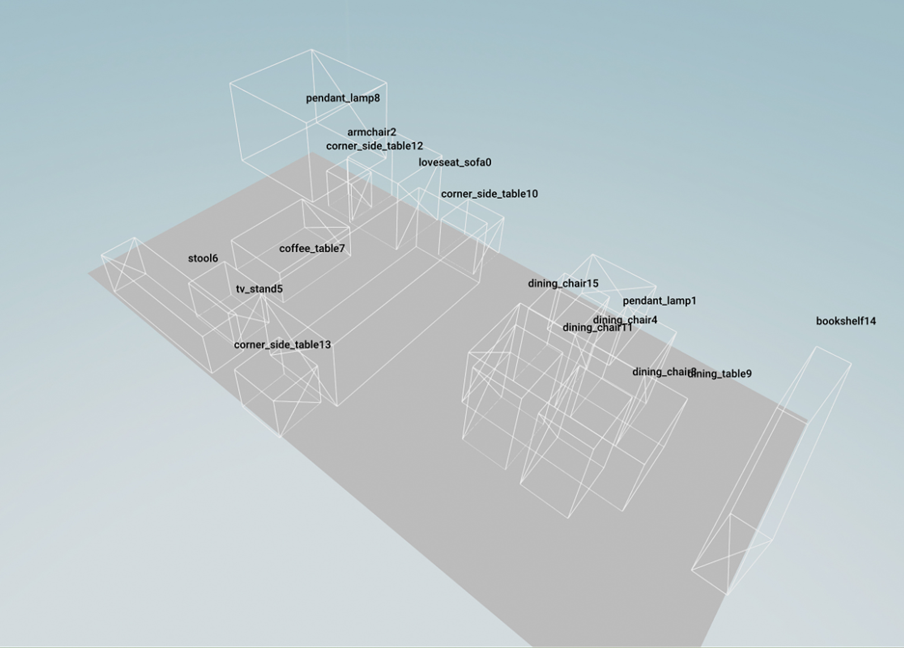

## Test Procthor Foor Plan

#### Generate center_info.json and room_mask.png
```
python scripts/preprocess/preprocess_data_prothor.py
```

#### [plan 1] Need to retrieve objects with 3D FRONT and 3D FUTURE dataset
```
python scripts/generata/generate_prothor.py
```
#### [plan 2] Do not need to download dataset. Just save layout bbox
```
sh run/test_procthor_bbox.sh exp_dir
```
This code add visualization of each scene layout with 1) floor plan mesh and 2) object bboxes. Here is an example:

<div style="text-align: center">

</div>


#### Then you could retrieve your own object dataset with the bbox

